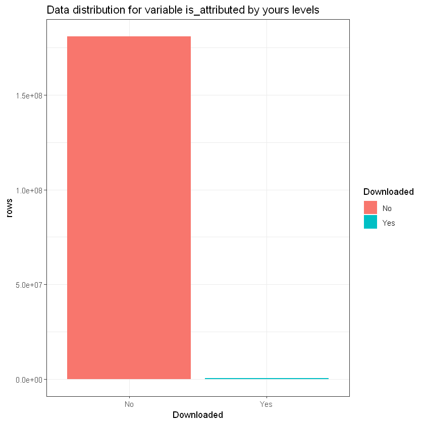
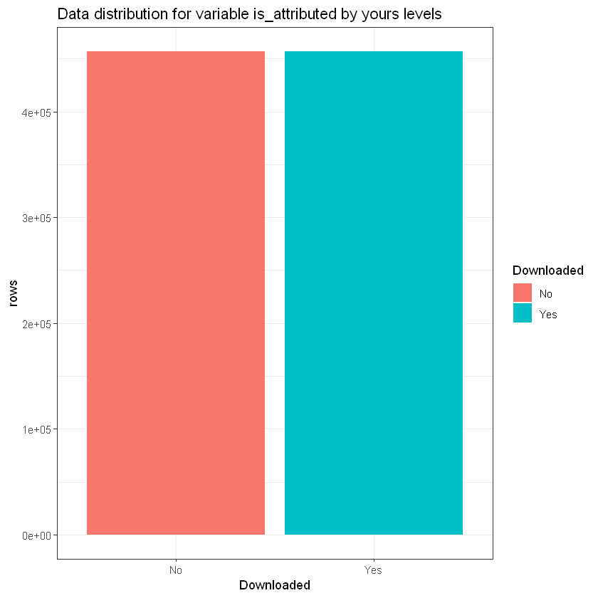
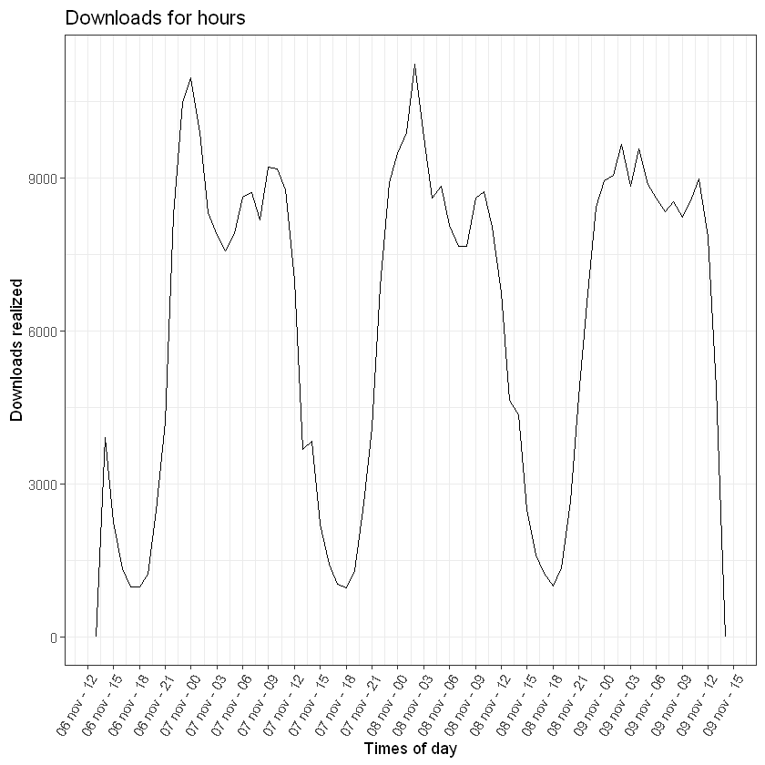
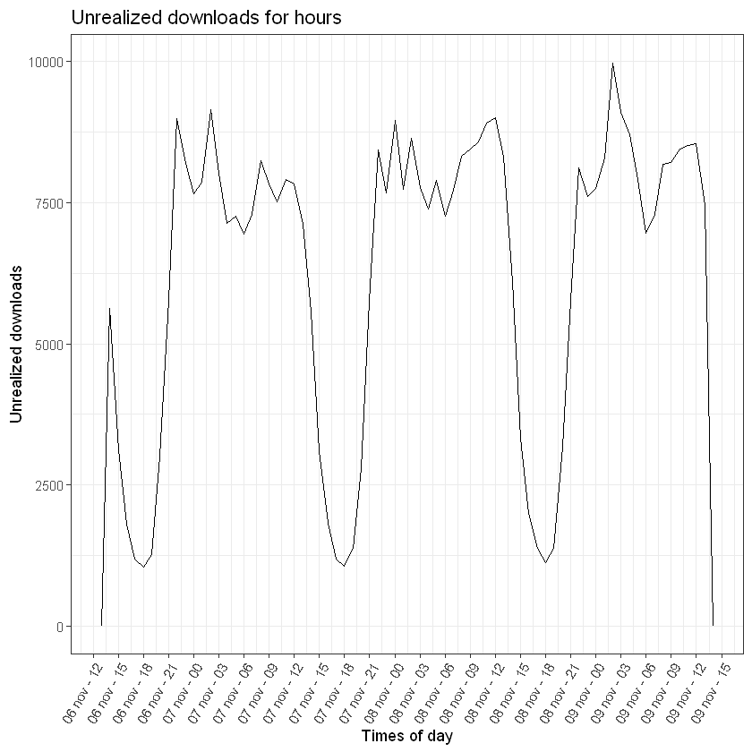
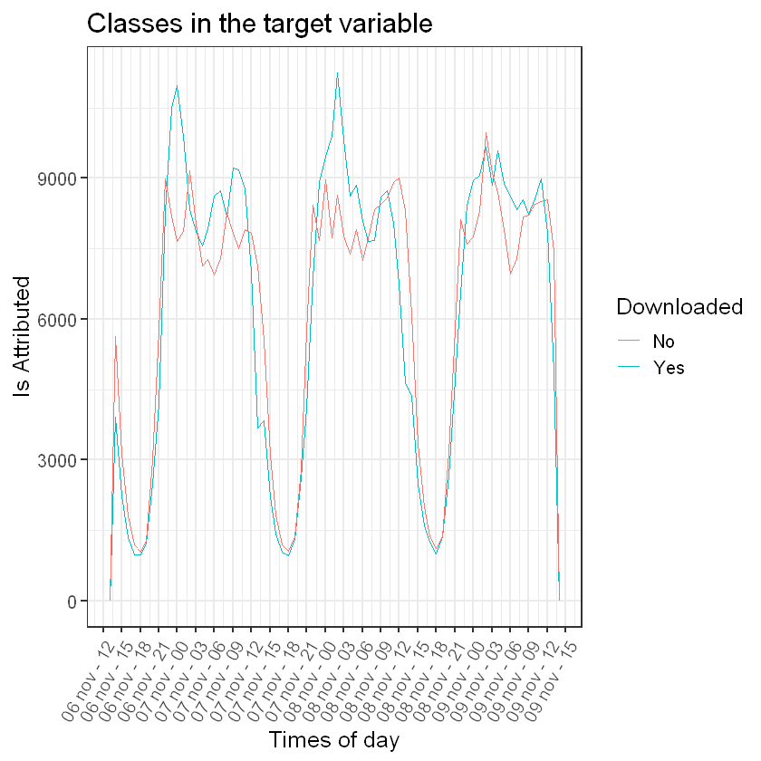
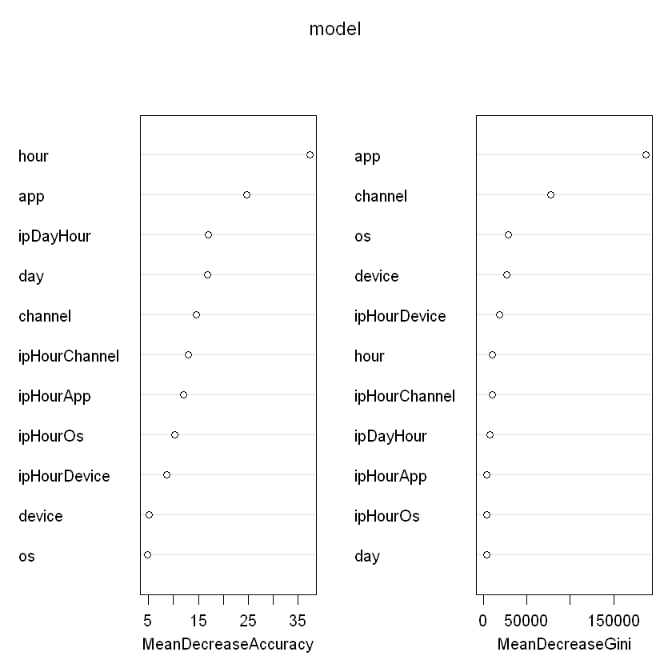

# **TalkingData AdTracking Fraud Detection Challenge**

*06 de março, 2020*

## **1.   Descrição geral do problema**

---

O risco de fraude está em toda parte, mas para as empresas que anunciam online, a fraude de cliques pode acontecer em um volume avassalador, resultando em dados de cliques enganosos e dinheiro desperdiçado. Os canais de anúncios podem aumentar os custos simplesmente quando pessoas ou bots clicam nos anúncios em grande escala, o que na prática não gera o resultado esperado. Com mais de 1 bilhão de dispositivos móveis em uso todos os meses, a China é o maior mercado móvel do mundo e, portanto, sofre com grandes volumes de tráfego fraudulento.

A <a href = 'https://www.talkingdata.com'>TalkingData</a>, a maior plataforma de Big Data independente da China, cobre mais de 70% dos dispositivos móveis ativos em todo o país. Eles lidam com 3 bilhões de cliques por dia, dos quais 90% são potencialmente fraudulentos. Sua abordagem atual para impedir fraudes de cliques para desenvolvedores de aplicativos é medir a jornada do clique de um usuário em todo o portfólio e sinalizar endereços IP que produzem muitos cliques, mas nunca acabam instalando aplicativos. Com essas informações, eles criaram uma lista negra de IPs e uma lista negra de dispositivos.

Embora bem-sucedidos, eles querem estar sempre um passo à frente dos fraudadores e desejam desenvolver ainda mais a solução a partir da criação de um algoritmo que possa prever se um usuário fará o download de um aplicativo depois de clicar em um anúncio de aplicativo para dispositivos móveis.

**Objetivo:** Em resumo, neste projeto, iremos construir um modelo de aprendizado de máquina para determinar se um clique é fraudulento ou não. Para a construção desse projeto, utilizaremos a linguagem R e o dataset disponível no Kaggle em: 

* https://www.kaggle.com/c/talkingdata-adtracking-fraud-detection/data

---


## **2. Carregando dados**

### **2.1 Importando bibliotecas necessárias**


Vamos começar nosso projeto importanto todas as bilbiotecas necessárias para a realização das fases iniciais de exploração e transformação dos dados (data Munging).


```R
# Definindo a oculatação de warnings.

options(warn = -1)

# Caso não possua uma das bibliotecas importadas abaixo, a instale com um dos comandos a seguir:

install.packages('data.table', repos='http://cran.rstudio.com/')
install.packages('bigreadr',   repos='http://cran.rstudio.com/')
install.packages('dplyr',      repos='http://cran.rstudio.com/')
install.packages('ggplot2',    repos='http://cran.rstudio.com/')
install.packages('fasttime',   repos='http://cran.rstudio.com/')
install.packages('lubridate',  repos='http://cran.rstudio.com/')
```


```R
# Importando bibliotecas.

library(data.table)
library(bigreadr)
library(dplyr)
library(ggplot2)
library(fasttime)
library(lubridate)
```

Vamos iniciar nosso projeto carregando os dados de teste e treino. Por serem muito grandes e impedirem seu manuseio em computadores com pouca memória RAM, adotamos a estratégia de dividir os conjuntos de dados originais  em 5 partes. Para este processo de fragmentação, utilizamos a ferramenta <a href = 'https://https://gitforwindows.org'>Git</a> a partir de uma emulação BASH usada para executá-lo a partir da linha de comando.

### **2.2 Carregando dados de treino**

Para este dataset, contabilizamos seu número total de linhas com o auxílo da função *nlines()* do pacote **bigreadr** sem ter a necessidade de carregar os dados na memória RAM. Em seguida, dividimos o número de linhas por 5.

```
## Determina o número de linhas do dataset.
#
# Decrementamos o valor retornado em 1 unidade para desconsiderar a linha de cabeçalho (header). 

numDeChunks   <- 5
totalDeLinhas <- nlines('train.csv') - 1 

numMaxLinhasPorChunks <- round(totalDeLinhas / numDeChunks)
```

Como resultado, obtivemos que o número total de cada fragmento do dataset original deve conter 36.980.778 linhas.

Utilizando o comando descrito abaixo no Git bash, realizamos efetivamente a divisão dos dados:

* **split train.csv -l 36980778**


Vamos visualizar as primeiras linhas de um dos chunks (fragmentos) criados.


```R
# Determinando o nome de cada um dos fragmentos do dataset original.

chunks <- c("train_p1.csv", "train_p2.csv", "train_p3.csv", "train_p4.csv", "train_p5.csv")

# Carregando o primeiro fragmento do conjunto de dados.

chunk <- fread(chunks[1])

# Capturando o nome das colunas do dataset.

cNames <- colnames(chunk)

# Imprimindo as primeiras linhas do dataset.

head(chunk)

# Removendo o dataset da memória.

rm(chunk)
```


<table>
<thead><tr><th scope=col>ip</th><th scope=col>app</th><th scope=col>device</th><th scope=col>os</th><th scope=col>channel</th><th scope=col>click_time</th><th scope=col>attributed_time</th><th scope=col>is_attributed</th></tr></thead>
<tbody>
	<tr><td> 83230             </td><td> 3                 </td><td>1                  </td><td>13                 </td><td>379                </td><td>2017-11-06 14:32:21</td><td>                   </td><td>0                  </td></tr>
	<tr><td> 17357             </td><td> 3                 </td><td>1                  </td><td>19                 </td><td>379                </td><td>2017-11-06 14:33:34</td><td>                   </td><td>0                  </td></tr>
	<tr><td> 35810             </td><td> 3                 </td><td>1                  </td><td>13                 </td><td>379                </td><td>2017-11-06 14:34:12</td><td>                   </td><td>0                  </td></tr>
	<tr><td> 45745             </td><td>14                 </td><td>1                  </td><td>13                 </td><td>478                </td><td>2017-11-06 14:34:52</td><td>                   </td><td>0                  </td></tr>
	<tr><td>161007             </td><td> 3                 </td><td>1                  </td><td>13                 </td><td>379                </td><td>2017-11-06 14:35:08</td><td>                   </td><td>0                  </td></tr>
	<tr><td> 18787             </td><td> 3                 </td><td>1                  </td><td>16                 </td><td>379                </td><td>2017-11-06 14:36:26</td><td>                   </td><td>0                  </td></tr>
</tbody>
</table>


Segundo a [documentação](https://www.kaggle.com/c/talkingdata-adtracking-fraud-detection/data) referente ao projeto, cada linha dos dados de treinamento contém um registro de clique, com os seguintes recursos:

* **ip**: define o endereço IP do clique;
* **app**: é o ID do aplicativo ao qual o anúncio se refere;
* **device**: é o ID do tipo de dispositivo do celular do usuário (por exemplo, iphone 6 plus, iphone 7, huawei mate 7 etc.); 
* **os**: é o ID da versão do sistema operacional do telefone móvel do usuário;
* **channel**: é ID do canal do editor de anúncios para celular;
* **click_time**: é o registro de data e hora do clique (UTC);
* **attributed_time**: se o usuário baixar o aplicativo após clicar em um anúncio, registra o instante de tempo em que o download do aplicativo foi realizado e;
* **is_attributed (*Target*)**: *é a variável alvo a ser prevista*, e indica se o aplicativo foi ou não baixado.

**Observação:** as variáveis **ip**, **app**, **device**, **os**, e **channel** estão codificadas.

#### **2.2.1 Realizando uma análise exploratória nos dados de treino**

Agora vamos verificar o balanceamento dos dados de treino segundo as classes que devem ser previstas. Ou seja, queremos saber as proporções de registros em que houve ou não um download. 


```R
# Contabilizando o número de linhas de cada fragmento segundo a variável target.

countTargetClass <- sapply(chunks, function(c) {

    # Carrega o chunk.

    chunk <- fread(c, col.names = cNames)

    # Elimina linhas duplicadas dentro do conjunto de dados.

    chunk <- chunk[!duplicated(chunk), ]

    # Retorna a quantidade de linhas que cada classe da variável target contém dentro do chunk.

    table(chunk$is_attributed)
})

# Transpondo os resultados obtidos.

chunksSummary <- t(countTargetClass)

# Alterando o nome das colunas.

colnames(chunksSummary) <- c('No', 'Yes')

# Verificando as proporções de registros segundo cada uma das classes da variável target em cada chunk.

prop.table(chunksSummary)
```


<table>
<thead><tr><th></th><th scope=col>No</th><th scope=col>Yes</th></tr></thead>
<tbody>
	<tr><th scope=row>train_p1.csv</th><td>0.1995894   </td><td>0.0005177438</td></tr>
	<tr><th scope=row>train_p2.csv</th><td>0.1996269   </td><td>0.0004779610</td></tr>
	<tr><th scope=row>train_p3.csv</th><td>0.1991522   </td><td>0.0005639860</td></tr>
	<tr><th scope=row>train_p4.csv</th><td>0.1995156   </td><td>0.0004459230</td></tr>
	<tr><th scope=row>train_p5.csv</th><td>0.1995958   </td><td>0.0005144285</td></tr>
</tbody>
</table>


Os resultados obtidos mostram que temos aproximadamente as mesmas proporções de dados para cada classe da variável target em cada um dos chunks. Mas, para facilitar nossa compreensão vamos agrupar estes valores e avaliar as proporções de todo o dataset de treino.


```R
# Somando os resultados de cada coluna da tabela.

totalTargetClass <- sapply(as.data.frame(chunksSummary), sum)

# Exbindo as proporções de cada uma das classes da variável target dentro do dataset de treino.

print(prop.table(totalTargetClass))
```

             No         Yes 
    0.997479958 0.002520042 
    

Vamos plotar estes resultados em um gráfico.


```R
# Plotando um gráfico de barras para representar as proporções de cada classe da variável is_attributed.

data.frame(Downloaded = c('No', 'Yes'), rows = totalTargetClass) %>%
    ggplot(aes(x = Downloaded, y = rows, fill = Downloaded)) + 
    geom_bar(stat = 'identity') + 
    labs(title = 'Data distribution for variable is_attributed by yours levels') + 
    theme_bw()
```





Há um alto desbalanceamento entre as classes que devemos prever. Cerca de **99,75%** dos dados classifica casos em que um indivíduo não realiza o download de um app que está sendo anunciado e em apenas **0,25%** o app é baixado.

Essa desproporção é um problema grave para a construção de modelos preditivos pois os fará aprender a identificar mais quando um indivúdo não efetua um download do que quando o faz e deveremos encontrar uma solução para isto. 

#### **2.2.2 Balanceando dados de treino**

Precisamos balancear os dados de treino de maneira que as proporções das classes da variável *is_attributed* sejam aproximamente iguais. Isto é, precisamos de um dataset que contenha a mesma quantidade de linhas com registros de indivíduos que tenham ou não feito download.

Para solucionar este problema e ainda facilitar o manuseio destes dados na memória RAM, vamos criar um novo conjunto de dados de treino que contenha todos os registros do dataset original em que um download foi efetuado (**is_attributed** == 1). Com base no número de linhas obtidas na etapa anterior, iremos amostrar os registros do dataset original em que um download não foi efetuado (**is_attributed** == 0).


```R
# Extraindo de cada chunk as linhas que contenham o registro de um download efetuado (is_attributed == 1).

sapply(chunks, function(c) {
    
    # Carrega um chunk.

    chunk <- fread(c, col.names = cNames)
    
    # Remove linhas duplicadas do dataset.

    chunk <- chunk[!duplicated(chunk), ]

    # Salva em um arquivo .csv as linhas em que is_attributed == 1.

    fwrite(chunk[chunk$is_attributed == 1,], 'train.csv', append = TRUE)

    # Define uma mensagem a ser retornada.

    return('Saved!')
})
```


<dl class=dl-horizontal>
	<dt>train_p1.csv</dt>
		<dd>'Saved!'</dd>
	<dt>train_p2.csv</dt>
		<dd>'Saved!'</dd>
	<dt>train_p3.csv</dt>
		<dd>'Saved!'</dd>
	<dt>train_p4.csv</dt>
		<dd>'Saved!'</dd>
	<dt>train_p5.csv</dt>
		<dd>'Saved!'</dd>
</dl>


```R
# Definindo o número de linhas em que houve download.

classSizeYes <- t(totalTargetClass)[2]

# Defindo o número de linhas em que não houve download que deve ser amostrado de cada chunk.

classSampleSizeNo <- round(classSizeYes / length(chunks))

# Definindo um seed para que o processo de amostragem sempre gere o mesmo resultado.

set.seed(100)

# Amostrando de cada chunk as linhas que contenham o registro de um download não efetuado (is_attributed == 0).

sapply(chunks, function(c) {
    
    # Carrega um chunk.

    chunk <- fread(c, col.names = cNames)

    # Remove linhas duplicadas do dataset.

    chunk <- chunk[!duplicated(chunk), ]

    chunk <- chunk[chunk$is_attributed == 0, ]

    # Salva em um arquivo .csv as linhas amostradas em que is_attributed == 0.

    fwrite(chunk[sample(1:nrow(chunk), classSampleSizeNo),], 'train.csv', append = TRUE)

    # Define uma mensagem a ser retornada.
    
    return('Saved!')
})
```


<dl class=dl-horizontal>
	<dt>train_p1.csv</dt>
		<dd>'Saved!'</dd>
	<dt>train_p2.csv</dt>
		<dd>'Saved!'</dd>
	<dt>train_p3.csv</dt>
		<dd>'Saved!'</dd>
	<dt>train_p4.csv</dt>
		<dd>'Saved!'</dd>
	<dt>train_p5.csv</dt>
		<dd>'Saved!'</dd>
</dl>


Vamos carregar o dataset gerado e ver os resultados.


```R
# Carregando dataset.

data = fread('train.csv')
```


```R
# Verificando o tamanho em Mbs do dataset.

format(object.size(data), units = 'Mb')
```


'66.2 Mb'


```R
# Plotando um gráfico para indicar a proporção de registros para cada classe da variável is_attributed.

data %>%
    mutate(Downloaded = factor(is_attributed, labels = c('No', 'Yes')))  %>%
    ggplot(aes(x = Downloaded, fill = Downloaded)) + 
    geom_bar() + 
    labs(title = 'Data distribution for variable is_attributed by yours levels') + 
    ylab('rows') + 
    theme_bw() 
```





Com isso finalizamos a preparação dos dados de treino para a nossa análise e encontramos uma solução para os problemas de memória RAM e desbalanceamento.

### **2.3 Carregando dados de teste**

De maneira similar ao que fizemos com o dataset de treino, contabilizamos o número total de linhas do dataset de teste com o auxílo da função *nlines()* do pacote **bigreadr** sem ter a necessidade de carregar os dados na memória RAM. Em seguida, dividimos o número de linhas por 5.

```
## Determina o número de linhas do dataset.
#
# Decrementamos o valor retornado em 1 unidade para desconsiderar a linha de cabeçalho (header). 

numDeChunks   <- 5
totalDeLinhas <- nlines('test.csv') - 1 

numMaxLinhasPorChunks <- round(totalDeLinhas / numDeChunks)
```

<p align = 'justify'> Como resultado, obtivemos que o número total de cada fragmento do dataset original deve conter 3.758.094 linhas.

<p align = 'justify'> Utilizando o comando descrito abaixo no Git bash, realizamos efetivamente a divisão dos dados:

* **split test.csv -l 3758094**

Vamos visualizar as primeiras linhas de um dos chunks (fragmentos) criados.


```R
# Determinando o nome de cada um dos fragmentos do dataset original.

chunks <- c("test_p1.csv", "test_p2.csv", "test_p3.csv", "test_p4.csv", "test_p5.csv")

# Carregando o primeiro fragmento do conjunto de dados.

chunk <- fread(chunks[1])

# Imprimindo as primeiras linhas do dataset.

head(chunk)

# Removendo o dataset da memória.

rm(chunk)
```


<table>
<thead><tr><th scope=col>click_id</th><th scope=col>ip</th><th scope=col>app</th><th scope=col>device</th><th scope=col>os</th><th scope=col>channel</th><th scope=col>click_time</th></tr></thead>
<tbody>
	<tr><td>0                  </td><td>  5744             </td><td> 9                 </td><td>1                  </td><td> 3                 </td><td>107                </td><td>2017-11-10 04:00:00</td></tr>
	<tr><td>1                  </td><td>119901             </td><td> 9                 </td><td>1                  </td><td> 3                 </td><td>466                </td><td>2017-11-10 04:00:00</td></tr>
	<tr><td>2                  </td><td> 72287             </td><td>21                 </td><td>1                  </td><td>19                 </td><td>128                </td><td>2017-11-10 04:00:00</td></tr>
	<tr><td>3                  </td><td> 78477             </td><td>15                 </td><td>1                  </td><td>13                 </td><td>111                </td><td>2017-11-10 04:00:00</td></tr>
	<tr><td>4                  </td><td>123080             </td><td>12                 </td><td>1                  </td><td>13                 </td><td>328                </td><td>2017-11-10 04:00:00</td></tr>
	<tr><td>5                  </td><td>110769             </td><td>18                 </td><td>1                  </td><td>13                 </td><td>107                </td><td>2017-11-10 04:00:00</td></tr>
</tbody>
</table>


Segundo a [documentação](https://www.kaggle.com/c/talkingdata-adtracking-fraud-detection/data) referente ao projeto, a variável **click_id** é uma variável auxiliar que é utilizada apenas para identificar as predições a serem submetidas no Kaggle.

## **3. Análise exploratória dos dados**

### **3.1 Visão geral dos dados**

Nesta etapa vamos buscar entender a disposição e as características dos dados dentro do dataset de treino além de  extrair insigths que possam auxiliar no processo de criação do modelo preditivo. 


```R
# Verificando os tipos das colunas carregadas do dataset.

glimpse(data)
```

    Observations: 913,690
    Variables: 8
    $ ip              <int> 204158, 29692, 64516, 172429, 199085, 82917, 126647...
    $ app             <int> 35, 9, 35, 35, 35, 19, 72, 29, 35, 19, 128, 29, 19,...
    $ device          <int> 1, 1, 1, 1, 1, 0, 1, 1, 1, 88, 1, 1, 0, 379, 1, 1, ...
    $ os              <int> 13, 22, 13, 46, 13, 24, 6, 41, 13, 24, 13, 19, 24, ...
    $ channel         <int> 21, 215, 21, 274, 274, 210, 101, 213, 21, 213, 243,...
    $ click_time      <chr> "2017-11-06 15:41:07", "2017-11-06 16:00:02", "2017...
    $ attributed_time <chr> "2017-11-07 08:17:19", "2017-11-07 10:05:22", "2017...
    $ is_attributed   <int> 1, 1, 1, 1, 1, 1, 1, 1, 1, 1, 1, 1, 1, 1, 1, 1, 1, ...
    


```R
# Verificando a existência de valores NA no dataset.

sapply(data, function(v) {anyNA(v)} )
```


<dl class=dl-horizontal>
	<dt>ip</dt>
		<dd>FALSE</dd>
	<dt>app</dt>
		<dd>FALSE</dd>
	<dt>device</dt>
		<dd>FALSE</dd>
	<dt>os</dt>
		<dd>FALSE</dd>
	<dt>channel</dt>
		<dd>FALSE</dd>
	<dt>click_time</dt>
		<dd>FALSE</dd>
	<dt>attributed_time</dt>
		<dd>FALSE</dd>
	<dt>is_attributed</dt>
		<dd>FALSE</dd>
</dl>


Vamos contabilizar o número de valores únicos que as variáveis **ip**, **app**, **device**, **os** e **channel** possuem.


```R
# Verificando o número de valores únicos presentes em cada uma das variáveis especificadas.

data[ , .(ip      = length(unique(ip)), 
          app     = length(unique(app)),
          device  = length(unique(device)),
          os      = length(unique(os)),
          channel = length(unique(channel))
)]
```


<table>
<thead><tr><th scope=col>ip</th><th scope=col>app</th><th scope=col>device</th><th scope=col>os</th><th scope=col>channel</th></tr></thead>
<tbody>
	<tr><td>253014</td><td>334   </td><td>1884  </td><td>186   </td><td>180   </td></tr>
</tbody>
</table>


Vemos que um IP pode estar relacionado a mais de um registro no dataset, ou seja, podemos ter o registro de um usuário associado a vários anúncios.

Agora iremos analisar as variáveis **click_time** e **attributed_time**.


```R
# Verificando os tipos das variáveis.

sapply(data[ , .(click_time, attributed_time)], class)
```


<dl class=dl-horizontal>
	<dt>click_time</dt>
		<dd>'character'</dd>
	<dt>attributed_time</dt>
		<dd>'character'</dd>
</dl>


Embora, estas colunas representem datas. O processo de carregamento dos dados não atribui o tipo de dado correto a estas variáveis. Deveremos realizar este procedimento manualmente.


```R
# Verificando se a variável click_time possui strings vazias.

table(click_time = data$click_time == '')
```


    click_time
     FALSE 
    913690 


```R
# Verificando se a variável attributed_time possui strings vazias.

table(attributed_time = data$attributed_time == '')
```


    attributed_time
     FALSE   TRUE 
    456845 456845 


Note que alguns dos valores da coluna **attributed_time** estão vazios. Isto ocorre porque esta variável indica o instante de tempo em que o download de um determinado app ocorreu. Caso o download não tenha sido efetuado, o valor da coluna é preenchido com uma string vazia e deveremos tratar isso.

Agora vamos nos certificar de que só existem dois grupos distintos dentro do conjunto de dados da variável que devemos prever.


```R
# Verificando as classes únicas presentes no dataset.

data[ , .(is_attributed = unique(is_attributed))]
```


<table>
<thead><tr><th scope=col>is_attributed</th></tr></thead>
<tbody>
	<tr><td>1</td></tr>
	<tr><td>0</td></tr>
</tbody>
</table>


Perfeito! Só existem dois valores distintos dentro do conjunto de dados da variável alvo: 
* **1**: para os registros em que o download foi realizado e;
* **0**: para os registros em que o download não foi realizado. 

### **3.2 Data Munging**

Vamos começar tratando as strings vazias presentes na variável **attributed_time** e aplicando algumas conversões de tipo de dados em algumas colunas do dataset.


```R
# Alterando strings vazias presentes na variável attributed_time para NA.

data$attributed_time[data$attributed_time == ''] = NA

# Convertendo a variável click_time para o tipo date.

data$click_time <- fastPOSIXct(data$click_time)

# Convertendo a variável attributed_time para o tipo date.

data$attributed_time <- fastPOSIXct(data$attributed_time)
```

### **3.3 Avaliando as variáveis de data do dataset**

Iremos iniciar esta etapa verificando a distribuição das datas em que ocorreram os cliques em anúncios registrados no dataset de treino.


```R
# Verificando a distribuição das datas presentes na variável click_time.

summary(data$click_time)
```


                     Min.               1st Qu.                Median 
    "2017-11-06 13:39:47" "2017-11-07 09:15:58" "2017-11-08 04:42:02" 
                     Mean               3rd Qu.                  Max. 
    "2017-11-08 04:25:05" "2017-11-09 00:21:43" "2017-11-09 14:00:00" 


Vamos verificar a amplitude da variável click_time, ou seja, o período de tempo entre o primeiro e o último registro presente neste conjunto de dados.


```R
# Calculando o período de tempo em que os dados presentes no dataset foram capturados.

max(data$click_time) - min(data$click_time)

```


    Time difference of 3.014039 days


Ou seja, temos dados que variam durante um período de aproximadamente 3 dias.

Muito bem, vamos criar um gráfico de séries temporais para verificar a frequência de cliques em anúncios que levaram a downloads a cada 3 horas durante esse período.


```R
# Criando um gráfico de série temporal para verificar o número de cliques em anúncios por hora que levaram a downloads de apps durante o período de tempo obtido no dataset.

data %>%
  mutate(datesTrunc = floor_date(click_time, unit = 'hour')) %>%
  group_by(datesTrunc) %>%
  summarise(downloadsRealized = sum(is_attributed)) %>%
  ggplot(aes(x = datesTrunc, y = downloadsRealized)) +
  geom_line() +
  scale_x_datetime(date_breaks = '3 hours', date_labels = '%d %b - %H') +
  theme_bw() + 
  theme(axis.text.x = element_text(angle = 60, hjust = 1)) + 
  xlab('Times of day') +
  ylab('Downloads realized') +
  labs(title = 'Downloads for hours')
```





O gráfico demostra que há aproximadamente o mesmo padrão de frequência de downloads durante os 3 dias tendo os maiores números de download entre as **23h e 14h** e os menores entre as **17h e 23h**.

Criaremos o mesmo tipo de gráfico para verificar a frequência de cliques em anúncios que não levaram a downloads a cada 3 horas durante esse período.


```R
# Criando um gráfico de série temporal para verificar o número de cliques em anúncios por hora que não levaram a downloads de apps durante o período de tempo obtido no dataset.

data %>%
  mutate(datesTrunc = floor_date(click_time, unit = 'hour')) %>%
  group_by(datesTrunc) %>%
  summarise(unrealizedDownloads = sum(!is_attributed)) %>%
  ggplot(aes(x = datesTrunc, y = unrealizedDownloads)) +
  geom_line() +
  scale_x_datetime(date_breaks = '3 hours', date_labels = '%d %b - %H') +
  theme_bw() + 
  theme(axis.text.x = element_text(angle = 60, hjust = 1)) + 
  xlab('Times of day') +
  ylab('Unrealized downloads') +
  labs(title = 'Unrealized downloads for hours')

```





As frequência de downloads realizados e não realizados parecem seguir a mesma tendência em cada hora de acordo com as horas dos dias. 

Vamos plotar as duas séries em um mesmo gráfico para verificar isto.


```R
# Criando um gráfico de série temporal para verificar o número de cliques em anúncios por hora que levaram ou não a downloads de apps durante o período de tempo obtido no dataset.

data %>%
  mutate(datesTrunc = floor_date(click_time, unit = 'hour')) %>%
  group_by(datesTrunc) %>%
  summarise(downloadsRealized = sum(is_attributed),
            unrealizedDownloads = sum(!is_attributed)) %>%
  ggplot() +
  geom_line(aes(x = datesTrunc, y = downloadsRealized, color = 'Yes')) +
  geom_line(aes(x = datesTrunc, y = unrealizedDownloads, color = 'No')) +
  scale_x_datetime(date_breaks = '3 hours', date_labels = '%d %b - %H') +
  theme_bw(base_size = 15) + 
  theme(axis.text.x = element_text(angle = 60, hjust = 1)) + 
  xlab('Times of day') +
  ylab('Is Attributed') +
  labs(title = 'Classes in the target variable', colour = 'Downloaded')

```





Esta similaridade entre estas duas classes mostra os horários em que os anúncios são mais ou menos acessados durante o dia.

## **4. Feature Engennier**


Precisamos preparar nosso dataset de treino para a fase de modelagem preditiva. Como a variável **attributed_time** registra o instante de tempo em que o evento que desejamos prever ocorre, iremos removê-la do nosso conjunto de dados.

Como não é viável manipular diretamente as datas da variável **click_time**, iremos apenas extrair os dias e as horas de cada registro e armazená-las em novas variáveis (**day** e **hour**).

A variável **ip** apresenta uma grande quantidade de valores únicos em relação as demais variáveis e por isso, iremos apenas utilizá-la indiretamente para a criação de novas variáveis a partir de agrupamentos.


```R
# Criando e removendo variáveis do dataset de treino.

data <- data %>%  
  select(-c(attributed_time)) %>%
  mutate(day = day(click_time), hour = hour(click_time)) %>% 
  select(-c(click_time)) %>%
  add_count(ip, day, hour)     %>% rename("ipDayHour"     = n)  %>%
  add_count(ip, hour, channel) %>% rename("ipHourChannel" = n) %>%
  add_count(ip, hour, os)      %>% rename("ipHourOs"      = n)  %>%
  add_count(ip, hour, app)     %>% rename("ipHourApp"     = n)  %>%
  add_count(ip, hour, device)  %>% rename("ipHourDevice"  = n)  %>%
  select(-c(ip))
```

O dataset de teste precisa passar pelo mesmo processo de feature engennier que os dados de treino e é isso que faremos a seguir. Como os dados de teste estão segmentados em chunks deveremos aplicar este procedimento iterativamente em cada um.


```R
# Determinando o nome de cada um dos fragmentos do dataset original.

chunks <- c("test_p1.csv", "test_p2.csv", "test_p3.csv", "test_p4.csv", "test_p5.csv")

# Carregando o primeiro fragmento do conjunto de dados.

chunk <- fread(chunks[1])

# Capturando o nome das colunas do dataset.

cNames <- colnames(chunk)

# Removendo o dataset da memória.

rm(chunk)

# Criando e removendo variáveis de cada chunk do dataset de teste.

sapply(chunks, function(c) {
    
    # Carrega um chunk.

    chunk <- fread(c, col.names = cNames)

    # Cria e remove variáveis do chunk.

    chunk <- chunk %>%  
      mutate(day = day(click_time), hour = hour(click_time)) %>% 
      select(-c(click_time)) %>%
      add_count(ip, day, hour)     %>% rename("ipDayHour"     = n)  %>%
      add_count(ip, hour, channel) %>% rename("ipHourChannel" = n) %>%
      add_count(ip, hour, os)      %>% rename("ipHourOs"      = n)  %>%
      add_count(ip, hour, app)     %>% rename("ipHourApp"     = n)  %>%
      add_count(ip, hour, device)  %>% rename("ipHourDevice"  = n)  %>%
      select(-c(ip))

    # Salva os resultados dos procedimentos efetuados em um arquivo .csv.
    
    fwrite(chunk, paste('conv_', c, sep = ''), append = TRUE)

    return('Saved!')
})
```


<dl class=dl-horizontal>
	<dt>test_p1.csv</dt>
		<dd>'Saved!'</dd>
	<dt>test_p2.csv</dt>
		<dd>'Saved!'</dd>
	<dt>test_p3.csv</dt>
		<dd>'Saved!'</dd>
	<dt>test_p4.csv</dt>
		<dd>'Saved!'</dd>
	<dt>test_p5.csv</dt>
		<dd>'Saved!'</dd>
</dl>


## **5. Modelagem Preditiva**

### **5.1 Importando bibliotecas necessárias**

Importaremos todas as bibliotecas necessárias para esta fase de modelagem preditiva.


```R
## Caso não possua uma das bibliotecas importadas abaixo, a instale com um dos comandos a seguir:

install.packages('caret',        repos='http://cran.rstudio.com/')
install.packages('e1071',        repos='http://cran.rstudio.com/')
install.packages('randomForest', repos='http://cran.rstudio.com/')
install.packages('pROC',         repos='http://cran.rstudio.com/')
install.packages('C50',          repos='http://cran.rstudio.com/')
install.packages('fastAdaboost', repos='http://cran.rstudio.com/')
install.packages('xgboost',      repos='http://cran.rstudio.com/')
```


```R
# Importando bibliotecas.

library(caret)
library(e1071)
library(randomForest)
library(pROC)
library(C50)
library(fastAdaboost)
library(xgboost)
```

Antes de começarmos, vamos dar uma olhada na forma do dataset que foi gerado após a fase de Feature Engennier. Também salvaremos este novo conjunto de dados para evitar que tenhamos que repetir todas as etapas efetuadas acima caso seja necessário.

Alguns dos algoritmos que iremos utilizar necessitam que a variável target seja do tipo factor, por isso iremos convertê-la a seguir.


```R
# Exibe as primeiras linhas do dataset.

head(data)

# Salva em um arquivo .csv o dataset especificado.

fwrite(data, 'data.csv')

# Convertendo variável target para o tipo factor.

data$is_attributed <- as.factor(data$is_attributed)
```


<table>
<thead><tr><th scope=col>app</th><th scope=col>device</th><th scope=col>os</th><th scope=col>channel</th><th scope=col>is_attributed</th><th scope=col>day</th><th scope=col>hour</th><th scope=col>ipDayHour</th><th scope=col>ipHourChannel</th><th scope=col>ipHourOs</th><th scope=col>ipHourApp</th><th scope=col>ipHourDevice</th></tr></thead>
<tbody>
	<tr><td>35 </td><td>1  </td><td>13 </td><td> 21</td><td>1  </td><td>6  </td><td>13 </td><td>1  </td><td>1  </td><td>1  </td><td>1  </td><td>1  </td></tr>
	<tr><td> 9 </td><td>1  </td><td>22 </td><td>215</td><td>1  </td><td>6  </td><td>14 </td><td>1  </td><td>1  </td><td>1  </td><td>1  </td><td>2  </td></tr>
	<tr><td>35 </td><td>1  </td><td>13 </td><td> 21</td><td>1  </td><td>6  </td><td>14 </td><td>3  </td><td>2  </td><td>3  </td><td>2  </td><td>5  </td></tr>
	<tr><td>35 </td><td>1  </td><td>46 </td><td>274</td><td>1  </td><td>6  </td><td>14 </td><td>1  </td><td>1  </td><td>1  </td><td>1  </td><td>1  </td></tr>
	<tr><td>35 </td><td>1  </td><td>13 </td><td>274</td><td>1  </td><td>6  </td><td>14 </td><td>1  </td><td>1  </td><td>1  </td><td>1  </td><td>1  </td></tr>
	<tr><td>19 </td><td>0  </td><td>24 </td><td>210</td><td>1  </td><td>6  </td><td>14 </td><td>1  </td><td>1  </td><td>1  </td><td>1  </td><td>1  </td></tr>
</tbody>
</table>


### **5.2 Avaliando a importância das variáveis com o algoritmo Random Forest**

Antes de iniciarmos a criação dos modelos propriamente dita, é interessante definirmos o quanto cada variável dentro do dataset ajuda a prever o valor da variável target.

Para fazermos isto, utilizaremos o algoritmo **Random Forest** para computar estes valores. Como não sabemos qual o ajuste de parâmetros do algoritmo é mais adequado para o nosso conjunto de dados, criaremos modelos que possuam de 1 a 15 árvores com 1 a 40 nós.

Salvaremos a acurárica de cada modelo em um Dataframe. Note que por ser um processo de treinamento muito demorado, salvamos os resultados obtidos  em um arquivo .csv que pode ser carregado com os resultados gerados pelo bloco de código a seguir.


```R
# Criando o dataframe para salvar os resultados dos modelos.

featuresRF <- data.frame()

# Definindo o número de nós e árvores a serem combinados para a criação de diferentes modelos.

nTrees <- 1:15
nNodes <- 1:40

# Define o número total de modelos a serem criados.

total <- length(nTrees) * length(nNodes)

# Define uma varíavel auxiliar para permitir o acompanhamento do progresso na avaliação dos modelos criados.

count <- 0

for(t in nTrees) {
    
  for(n in nNodes) {
    
    # Define um seed para permitir que os mesmos resultados dos experimentos sejam reproduzíveis.
    
    set.seed(100)
    
    # Cria o modelo Random Forest a ser avaliado.

    model <- randomForest(is_attributed ~ .,
                          data       = data, 
                          ntree      = t, 
                          nodesize   = n, 
                          importance = T)
    
    # Computa a confusionMatrix gerada a partir do modelo criado.

    cm <- confusionMatrix(table(
        data      = model$y, 
        reference = model$predicted
    ))
    
    # Armazena os parâmetros utilizados para criação do modelo e a acurácia obtida no dataframe.

    featuresRF <- rbind(featuresRF, data.frame(
        nodes    = n, 
        nTree    = t, 
        accuracy = unname(cm$overall['Accuracy'])
    ))
    
    # Incrementa o número de modelos avaliados.

    count <- count + 1

    # Imprime a porcetagem de progresso do treinamento e a melhor acurácia já alcançada.

    # print(paste(100 * count / total, '%, best accuracy: ', max(featuresRF$accuracy)))
  }
}

# Salvando dataframe em um arquivo .csv.

fwrite(featuresRF, 'featuresRF.csv')
```

Caso deseje carregar os resultados gerados pelo bloco de código anterior:


```R
# Carregando dataframe com os resultados obtidos para cada modelo randomForest criado.

featuresRF <- fread('featuresRF.csv')
```

Imprimiremos o registro do modelo que apresentou a melhor acurácia.


```R
# Imprimindo registro do modelo que alcançou a maior acurácia.

bestRF <- featuresRF[featuresRF$accuracy == max(featuresRF$accuracy),]

bestRF
```


<table>
<thead><tr><th scope=col>nodes</th><th scope=col>nTree</th><th scope=col>accuracy</th></tr></thead>
<tbody>
	<tr><td>1        </td><td>15       </td><td>0.9332079</td></tr>
</tbody>
</table>


Recriaremos este modelo e imprimiremos suas estatísticas.


```R
# Definindo fórmula a ser utilizada pelo modelo.

f <- is_attributed ~ . 

# Criando modelo.

model <- randomForest(f,
                      data       = data, 
                      ntree      = bestRF$nTree, 
                      nodesize   = bestRF$nodes,
                      importance = T)
                      
# Imprimindo o modelo.

model
```


    
    Call:
     randomForest(formula = f, data = data, ntree = bestRF$nTree,      nodesize = bestRF$nodes, importance = T) 
                   Type of random forest: classification
                         Number of trees: 15
    No. of variables tried at each split: 3
    
            OOB estimate of  error rate: 8.51%
    Confusion matrix:
           0      1 class.error
    0 437046  19350  0.04239739
    1  58371 398023  0.12789607


Agora podemos plotar o modelo em um gráfico e verificar o nível de importância das variáveis do dataset para prever a variável alvo.


```R
# Plotando gráfico para visualizar o nível de importância de cada variável no processo de predição da variável alvo.

v <- as.data.frame(varImpPlot(model))
```





Também podemos mensurar numericamente o quanto cada variável auxilia no processo de predição da variável alvo.


```R
# Captura em ordem decrescente de nível de importância o nome das variáveis.

names <- rownames(v[order(v$MeanDecreaseAccuracy, decreasing = T),])

# Imprime o resultado.

v[order(v$MeanDecreaseAccuracy, decreasing = T),]
```


<table>
<thead><tr><th></th><th scope=col>MeanDecreaseAccuracy</th><th scope=col>MeanDecreaseGini</th></tr></thead>
<tbody>
	<tr><th scope=row>hour</th><td>37.551580 </td><td> 10577.046</td></tr>
	<tr><th scope=row>app</th><td>24.792194 </td><td>187328.674</td></tr>
	<tr><th scope=row>ipDayHour</th><td>16.977815 </td><td>  7862.437</td></tr>
	<tr><th scope=row>day</th><td>16.828407 </td><td>  3723.729</td></tr>
	<tr><th scope=row>channel</th><td>14.642123 </td><td> 77184.869</td></tr>
	<tr><th scope=row>ipHourChannel</th><td>12.961836 </td><td> 10432.957</td></tr>
	<tr><th scope=row>ipHourApp</th><td>12.080415 </td><td>  4407.245</td></tr>
	<tr><th scope=row>ipHourOs</th><td>10.302811 </td><td>  4051.281</td></tr>
	<tr><th scope=row>ipHourDevice</th><td> 8.651207 </td><td> 18862.988</td></tr>
	<tr><th scope=row>device</th><td> 5.004703 </td><td> 27319.892</td></tr>
	<tr><th scope=row>os</th><td> 4.703069 </td><td> 28830.044</td></tr>
</tbody>
</table>


### **5.3 Criando modelos preditivos**

Os modelos não paramêtricos baseados em árvores de decisão tendem a apresentar um bom desempenho em um período de tempo de treinamento muito baixo quando o conjunto de dados é muito grande. Por isso, iremos selecionar 4 algoritmos que sigam esta filosofia, são eles: **Random Forest**, **C 5.0**, **Adaboost** e **XGboost**. Também utilizaremos o algoritmo **Naive Bayes** por apresentar uma boa performance no treinamento de modelos com grandes quantidades de dados. 

A estratégia que iremos utilizar para o treinamento dos modelos será a de avaliar o desempenho de cada um utilizando os valores padrões que possuem com poucas modificações. Com base nos resultados que forem obtidos, iremos selecionar o melhor e otimizar seus parâmetros.

Como o conjunto de dados de teste não possui a variável target, utilizaremos o dataset de treino para fazer as predições e avaliar o desempenho do modelo, por isso, teremos que tomar mais cuidado com overfiting.

#### **5.3.1 Modelo Naive Bayes**


```R
# Definindo fórmula a ser utilizada pelo modelo.

f <- is_attributed ~ . 

# Criando o modelo baseado no algoritmo Naive Bayes.

model_nb <- naiveBayes(f , data = data)
```


```R
# Realizando as previsões como o modelo baseado no algoritmo Naive Bayes.

pred <- predict(model_nb, data, type = 'class')
```


```R
# Criando a Confusion Matrix a partir das previsões.  

confusionMatrix(table(pred = pred, data = data$is_attributed))
```


    Confusion Matrix and Statistics
    
        data
    pred      0      1
       0 440136 319307
       1  16709 137538
                                              
                   Accuracy : 0.6322          
                     95% CI : (0.6313, 0.6332)
        No Information Rate : 0.5             
        P-Value [Acc > NIR] : < 2.2e-16       
                                              
                      Kappa : 0.2645          
                                              
     Mcnemar's Test P-Value : < 2.2e-16       
                                              
                Sensitivity : 0.9634          
                Specificity : 0.3011          
             Pos Pred Value : 0.5796          
             Neg Pred Value : 0.8917          
                 Prevalence : 0.5000          
             Detection Rate : 0.4817          
       Detection Prevalence : 0.8312          
          Balanced Accuracy : 0.6322          
                                              
           'Positive' Class : 0               
                                              


```R
# Calculando a AUC para o modelo.

nbAuc1 <- auc(roc(as.integer(data$is_attributed), as.integer(pred)))

# Exibe o resultado.

nbAuc1
```

    Setting levels: control = 1, case = 2
    Setting direction: controls < cases
    


0.63224288325362


##### **5.3.1.1 Modelo Naive Bayes com o parâmetro Laplace modificado**

Tentaremos modificar o valor do argumento laplace do algorimto com o objetivo de aumentar a acurárica deste modelo com o conjunto de dados de treino.


```R
# Definindo fórmula a ser utilizada pelo modelo.

f <- is_attributed ~ . 

# Criando o modelo baseado no algoritmo Naive Bayes.

model_nb <- naiveBayes(f , data = data, laplace = 100)
```


```R
# Realizando as previsões como o modelo baseado no algoritmo Naive Bayes.

pred <- predict(model_nb, data, type = 'class')
```


```R
# Criando a Confusion Matrix a partir das previsões.  

confusionMatrix(table(pred = pred, data = data$is_attributed))
```


    Confusion Matrix and Statistics
    
        data
    pred      0      1
       0 440136 319307
       1  16709 137538
                                              
                   Accuracy : 0.6322          
                     95% CI : (0.6313, 0.6332)
        No Information Rate : 0.5             
        P-Value [Acc > NIR] : < 2.2e-16       
                                              
                      Kappa : 0.2645          
                                              
     Mcnemar's Test P-Value : < 2.2e-16       
                                              
                Sensitivity : 0.9634          
                Specificity : 0.3011          
             Pos Pred Value : 0.5796          
             Neg Pred Value : 0.8917          
                 Prevalence : 0.5000          
             Detection Rate : 0.4817          
       Detection Prevalence : 0.8312          
          Balanced Accuracy : 0.6322          
                                              
           'Positive' Class : 0               
                                              


```R
# Calculando a AUC para o modelo.

nbAuc2 <- auc(roc(as.integer(data$is_attributed), as.integer(pred)))

# Exibe o resultado.

nbAuc2
```

    Setting levels: control = 1, case = 2
    Setting direction: controls < cases
    


0.63224288325362


#### **5.3.2 Modelo Random Forest**

Vamos utilizar o mesmo número de árvores e nós selecionados durante a etapa de avaliação da importância das variáveis para a construção deste modelo.


```R
# Definindo fórmula a ser utilizada pelo modelo.

f <- is_attributed ~ . 

# Criando o modelo baseado no algoritmo Random Forest.

model_rf <- randomForest(f, 
                         ntree      = bestRF$nTree, 
                         nodesize   = bestRF$nodes, 
                         data       = data)
```


```R
# Realizando as previsões como o modelo baseado no algoritmo Random Forest.

pred <- predict(model_rf, data, type = 'response')
```


```R
# Criando a Confusion Matrix a partir das previsões.  

confusionMatrix(table(pred = pred, data = data$is_attributed))
```


    Confusion Matrix and Statistics
    
        data
    pred      0      1
       0 446915  45606
       1   9930 411239
                                              
                   Accuracy : 0.9392          
                     95% CI : (0.9387, 0.9397)
        No Information Rate : 0.5             
        P-Value [Acc > NIR] : < 2.2e-16       
                                              
                      Kappa : 0.8784          
                                              
     Mcnemar's Test P-Value : < 2.2e-16       
                                              
                Sensitivity : 0.9783          
                Specificity : 0.9002          
             Pos Pred Value : 0.9074          
             Neg Pred Value : 0.9764          
                 Prevalence : 0.5000          
             Detection Rate : 0.4891          
       Detection Prevalence : 0.5390          
          Balanced Accuracy : 0.9392          
                                              
           'Positive' Class : 0               
                                              


```R
# Calculando a AUC para o modelo.

rfAuc <- auc(roc(as.integer(data$is_attributed), as.integer(pred)))

# Exibe o resultado.

rfAuc
```

    Setting levels: control = 1, case = 2
    Setting direction: controls < cases
    


0.939217896660793


#### **5.3.3 Modelo C 5.0**


```R
# Definindo a matriz de custos a ser utilizada pelo modelo.

cost <- matrix(c(0, 1, 1, 0), nrow = 2, dimnames = list(c("No", "Yes"), c("No", "Yes")))

# Visualizando a matriz.

cost
```


<table>
<thead><tr><th></th><th scope=col>No</th><th scope=col>Yes</th></tr></thead>
<tbody>
	<tr><th scope=row>No</th><td>0</td><td>1</td></tr>
	<tr><th scope=row>Yes</th><td>1</td><td>0</td></tr>
</tbody>
</table>


```R
# Definindo fórmula a ser utilizada pelo modelo.

f <- is_attributed ~ . 

# Criando o modelo baseado no algoritmo C 5.0.

model_c50 <-  C5.0(f, data = data, trials = 100, cost = cost)
```


```R
# Realizando as previsões como o modelo baseado no algoritmo C 5.0.

pred <- predict(model_c50, data)
```


```R
# Criando a Confusion Matrix a partir das previsões.  

confusionMatrix(table(pred = pred, data = data$is_attributed))
```


    Confusion Matrix and Statistics
    
        data
    pred      0      1
       0 441719  50503
       1  15126 406342
                                              
                   Accuracy : 0.9282          
                     95% CI : (0.9276, 0.9287)
        No Information Rate : 0.5             
        P-Value [Acc > NIR] : < 2.2e-16       
                                              
                      Kappa : 0.8563          
                                              
     Mcnemar's Test P-Value : < 2.2e-16       
                                              
                Sensitivity : 0.9669          
                Specificity : 0.8895          
             Pos Pred Value : 0.8974          
             Neg Pred Value : 0.9641          
                 Prevalence : 0.5000          
             Detection Rate : 0.4834          
       Detection Prevalence : 0.5387          
          Balanced Accuracy : 0.9282          
                                              
           'Positive' Class : 0               
                                              


```R
# Calculando a AUC para o modelo.

c50Auc <- auc(roc(as.integer(data$is_attributed), as.integer(pred)))

# Exibe o resultado.

c50Auc
```

    Setting levels: control = 1, case = 2
    Setting direction: controls < cases
    


0.92817148048025


#### **5.3.4 Modelo Adaboost**


```R
# Definindo fórmula a ser utilizada pelo modelo.

f <- is_attributed ~ . 

# Criando o modelo baseado no algoritmo Adaboost.

model_adaboost <-  adaboost(formula = f, data = as.data.frame(data), nIter = 15)
```


```R
# Realizando as previsões como o modelo baseado no algoritmo Adaboost.

pred <- predict(model_adaboost, data, type = 'class')
```


```R
# Criando a Confusion Matrix a partir das previsões.  

confusionMatrix(table(pred = pred$class, data = data$is_attributed))
```


    Confusion Matrix and Statistics
    
        data
    pred      0      1
       0 445901  22198
       1  10944 434647
                                              
                   Accuracy : 0.9637          
                     95% CI : (0.9633, 0.9641)
        No Information Rate : 0.5             
        P-Value [Acc > NIR] : < 2.2e-16       
                                              
                      Kappa : 0.9275          
                                              
     Mcnemar's Test P-Value : < 2.2e-16       
                                              
                Sensitivity : 0.9760          
                Specificity : 0.9514          
             Pos Pred Value : 0.9526          
             Neg Pred Value : 0.9754          
                 Prevalence : 0.5000          
             Detection Rate : 0.4880          
       Detection Prevalence : 0.5123          
          Balanced Accuracy : 0.9637          
                                              
           'Positive' Class : 0               
                                              


```R
# Calculando a AUC para o modelo.

adaboostAuc <- auc(roc(as.integer(data$is_attributed), as.integer(pred$class)))

# Exibe o resultado.

adaboostAuc
```

    Setting levels: control = 1, case = 2
    Setting direction: controls < cases
    


0.963727303571233


#### **5.3.5 Modelo XGboost**


```R
  # Criando o modelo baseado no algoritmo XGboost.

  model_xgboost <- xgboost(
      data      = as.matrix(data %>% select(-is_attributed)), # Define as variáveis preditoras.
      label     = as.matrix(data$is_attributed),              # Define a variável target.
      max.depth = 40,                                         # Defie o tamanho máximo da árvore.
      eta       = 1,                                          # Define a taxa de aprendizado do modelo.
      nthread   = 4,                                          # Define o número de threads que devem ser usadas. Quanto maior for esse número, mais rápido será o treinamento.
      nrounds   = 100,                                        # Define o número de iterações.
      objective = "binary:logistic",                          # Define que o modelo deve ser baseado em uma regressão logistica binária.
      verbose   = F                                           # Exibe a queda da taxa de erro durante o treinamento.
)
```


```R
# Realizando as previsões com o modelo baseado no algoritmo XGboost.

pred <- predict(model_xgboost, as.matrix(data %>% select(-is_attributed)))
```


```R
# Definindo threshold.

th <- 0.5

# Classificando os resultados segundo o threshold especificado.

predClass <- ifelse(pred > th, 1, 0)
```


```R
# Criando a Confusion Matrix a partir das previsões.  

confusionMatrix(table(pred = predClass, data = data$is_attributed))
```


    Confusion Matrix and Statistics
    
        data
    pred      0      1
       0 447539  19548
       1   9306 437297
                                              
                   Accuracy : 0.9684          
                     95% CI : (0.9681, 0.9688)
        No Information Rate : 0.5             
        P-Value [Acc > NIR] : < 2.2e-16       
                                              
                      Kappa : 0.9368          
                                              
     Mcnemar's Test P-Value : < 2.2e-16       
                                              
                Sensitivity : 0.9796          
                Specificity : 0.9572          
             Pos Pred Value : 0.9581          
             Neg Pred Value : 0.9792          
                 Prevalence : 0.5000          
             Detection Rate : 0.4898          
       Detection Prevalence : 0.5112          
          Balanced Accuracy : 0.9684          
                                              
           'Positive' Class : 0               
                                              


```R
# Calculando a AUC para o modelo.

xgboostAuc <- auc(roc(as.integer(data$is_attributed), as.integer(predClass)))

# Exibe o resultado.

xgboostAuc
```

    Setting levels: control = 1, case = 2
    Setting direction: controls < cases
    


0.968420361391719


#### **5.3.6 Otimizando o modelo com o melhor desempenho**

Determinaremos qual modelo teve o melhor desempenho para o conjunto de dados de treino a partir dos valores **AUC** (Area under cover) gerados por cada um.


```R
# Criando um vetor com os valores AUC obtidos por cada modelo.

aucModels <- c(
    nbAuc1      = nbAuc1,
    nbAuc2      = nbAuc2,
    rfAuc       = rfAuc,
    c50Auc      = c50Auc, 
    adaboostAuc = adaboostAuc,
    xgboostAuc  = xgboostAuc
)

# Determinando o maior valor AUC.

head(sort(aucModels, decreasing = T), 1)
```


<strong>xgboostAuc:</strong> 0.968420361391719


Concluímos que o modelo criado com o algoritmo **xgboost** foi o que apresentou o melhor desempenho. Agora iremos modificar os parâmetros deste algoritmo com o objetivo de otimizar sua performance.


```R
  # Criando o modelo baseado no algoritmo XGboost.

  model_xgboost <- xgboost(
      data      = as.matrix(data %>% select(-is_attributed)), # Define as variáveis preditoras.
      label     = as.matrix(data$is_attributed),              # Define a variável target.
      max.depth = 40,                                         # Defie o tamanho máximo da árvore.
      eta       = 1,                                          # Define a taxa de aprendizado do modelo.
      nthread   = 2,                                          # Define o número de threads que devem ser usadas. Quanto maior for esse número, mais rápido será o treinamento.
      nrounds   = 500,                                        # Define o número de iterações.
      objective = "binary:logistic",                          # Define que o modelo deve ser baseado em uma regressão logistica binária.
      verbose   = F                                           # Exibe a queda da taxa de erro durante o treinamento.
)
```


```R
# Realizando as previsões como o modelo baseado no algoritmo XGboost.

pred <- predict(model_xgboost, as.matrix(data %>% select(-is_attributed)))
```


```R
# Definindo threshold.

th <- 0.5

# Classificando os resultados segundo o threshold especificado.

predClass <- ifelse(pred > th, 1, 0)
```


```R
# Criando a Confusion Matrix a partir das previsões.  

confusionMatrix(table(pred = predClass, data = data$is_attributed))
```


    Confusion Matrix and Statistics
    
        data
    pred      0      1
       0 447457  19466
       1   9388 437379
                                              
                   Accuracy : 0.9684          
                     95% CI : (0.9681, 0.9688)
        No Information Rate : 0.5             
        P-Value [Acc > NIR] : < 2.2e-16       
                                              
                      Kappa : 0.9368          
                                              
     Mcnemar's Test P-Value : < 2.2e-16       
                                              
                Sensitivity : 0.9795          
                Specificity : 0.9574          
             Pos Pred Value : 0.9583          
             Neg Pred Value : 0.9790          
                 Prevalence : 0.5000          
             Detection Rate : 0.4897          
       Detection Prevalence : 0.5110          
          Balanced Accuracy : 0.9684          
                                              
           'Positive' Class : 0               
                                              


```R
# Calculando a AUC para o modelo.

xgboostAuc <- auc(roc(as.integer(data$is_attributed), as.integer(predClass)))

# Exibe o resultado.

xgboostAuc
```

    Setting levels: control = 1, case = 2
    Setting direction: controls < cases
    


0.968420361391719


Vemos que o processo de otimização produziu uma pequena melhora na métrica AUC gerada pelo modelo. Isso pode nos indicar que chegamos a maior precisão que o modelo pode nos fornecer com este conjunto de dados.

Agora, vamos efetuar as previsões dos dados de teste e submetê-las no [site da competição no Kaggle.](https://www.kaggle.com/c/talkingdata-adtracking-fraud-detection/submissions)


```R
# Determinando o nome de cada um dos fragmentos do dataset original.

chunks <- c("conv_test_p1.csv", "conv_test_p2.csv", "conv_test_p3.csv", "conv_test_p4.csv", "conv_test_p5.csv")

# Carregando o primeiro fragmento do conjunto de dados.

chunk <- fread(chunks[1])

# Capturando o nome das colunas do dataset.

cNames <- colnames(chunk)

# Removendo o dataset da memória.

rm(chunk)

# Realizando previsões para o dataset de treino com base no modelo xgboost criado.

sapply(chunks, function(c) {
    
    # Carrega um chunk.
    
    chunk <- fread(c, col.names = cNames)
    
    # Realiza as previsões para os dados do chunk com o modelo especificado.
    
    pred <- predict(model_xgboost, as.matrix(chunk[, !'click_id']), predcontrib = F)
    
    # Salva as previsões em um arquivo .csv.
    
    fwrite(
        data.frame(
            click_id      = as.integer(chunk$click_id), 
            is_attributed = as.numeric(pred)
        ), 'results.csv', append = TRUE
    )
    
    # Remove variáveis da memória.
    
    rm(chunk, pred)
    
    # Retorna uma mensagem ao fim da iteração.
    
    return('Saved!')
})
```


<dl class=dl-horizontal>
	<dt>conv_test_p1.csv</dt>
		<dd>'Saved!'</dd>
	<dt>conv_test_p2.csv</dt>
		<dd>'Saved!'</dd>
	<dt>conv_test_p3.csv</dt>
		<dd>'Saved!'</dd>
	<dt>conv_test_p4.csv</dt>
		<dd>'Saved!'</dd>
	<dt>conv_test_p5.csv</dt>
		<dd>'Saved!'</dd>
</dl>


Por fim, obtemos as seguintes pontuações com a métrica AUC no Kaggle ao submeter as previsões geradas pelo nosso modelo para os dados de teste:

* **Pontuação privada:** 0.93511
* **Pontuação pública:** 0.93311

## **Entre em contato comigo!**

Caso tenha alguma dúvida, sugestão ou apenas queira trocar uma ideia sobre este projeto, não hesite em entrar em contato comigo!

<table align='center'>
    <tr>
        <td>
            
        </td>
        <td>
            <p>
                <a href="franklinfs390@gmail.com">E-mail</href>
            </p>
        </td>
    <td>
            
    </td>
    <td>
        <p>
            <a href="https://www.linkedin.com/in/franklinfs390/">Linkedin</href>
        </p>
    </td>
    <td>
        
    </td>
    <td>
        <p>
            <a href="https://github.com/franklin390">Github</href>
        </p>
    </td>
  </tr>

</table>
